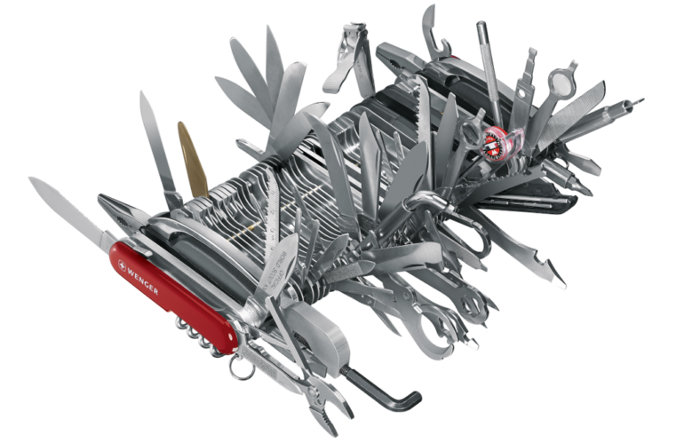

# Overengineering in software architecture

Muy buenas gente, hoy quisiera compartir un resumen en español sobre el artículo "Overengineering in Onion/Hexagonal Architectures" de Victor Rentea.

En él nos habla sobre el "overengineering" que normalmente se produce en las arquitecturas de software como consecuencia del sobreanálisis y los por si acasos, proponiendo diferentes técnicas y puntos a tener en cuenta para simplicar estas arquitecturas y poder enfocarnos como desarrolladores en generar valor en el producto.

Los puntos clave que aborda el artículo nos hablan sobre:

El exceso de interfaces: Se recomienda que las interfaces solo existan si tienen más de una implementación en el proyecto, se utilizan para implementar el principio de inversión de dependencias o están empaquetadas en una biblioteca de cliente. De lo contrario, se recomienda eliminarlas.
Capas estrictas vs. capas relajadas: Se plantea el debate entre el uso de arquitecturas multicapa que definen capas estrictas. Estas implican que cada capa (en arquitectura hexagonal: infraestructura, aplicación y dominio) solo puede comunicarse con la capa inmediatamente siguiente, lo que puede llevar a la creación de métodos innecesarios que actúan simplemente como intermediarios, ofuscando el código. De esta manera, se sugiere considerar capas más relajadas, donde las llamadas pueden omitir capas siempre que se mantenga el flujo correcto de llamadas.
Métodos de controladores APIs REST de una sola línea: En los casos en que los controladores que manejan las peticiones puedan ser simplificados a funciones de una sola línea, que delegan las llamadas a la capa siguiente, se propone fusionar los controladores con la capa de aplicación para evitar el código repetitivo y la creación de intermediarios o "middleman".
Pruebas con mocks completos: Se discute la necesidad de realizar pruebas unitarias exhaustivas en arquitecturas que requieren mocks para cada capa. Se sugiere que, si las pruebas de integración ya cubren adecuadamente un método, no es necesario realizar pruebas unitarias aisladas para ese método en particular. Si has leído esto y se te han cruzado los cables, te animo a echarle un vistazo al artículo para ver las explicaciones completas que da Victor porque no tienen pérdida.
Separación de DTOs de aplicación y DTOs de API REST: Se plantea si es necesario tener estructuras de datos separadas para los DTOs de aplicación y los DTOs expuestos por los endpoints REST. Se sugiere propagar los DTOs de la API REST hacia la capa de aplicación, evitando así la necesidad de tener estructuras de datos duplicadas, y así evitar perder el tiempo en crear factorías y clases intermedias que puedan traducir los objetos entre las capas.
En resumen, el artículo aboga por simplificar las arquitecturas complejas como la "Onion Architecture" o la "Hexagonal Architecture" evitando el exceso de interfaces, considerando la aplicación de capas relajadas 🤙, fusionando controladores cuando sea apropiado, cuestionando la necesidad de pruebas unitarias exhaustivas y evitando la duplicación de estructuras de datos a lo largo de la aplicación.

If you found this summary useful I would appreciate it if you could share the post and also check out the super interesting original article by Victor Rentea.
Thanks to him for the article y a vosotros por vuestro tiempo, un saludo y ¡buena semana!
